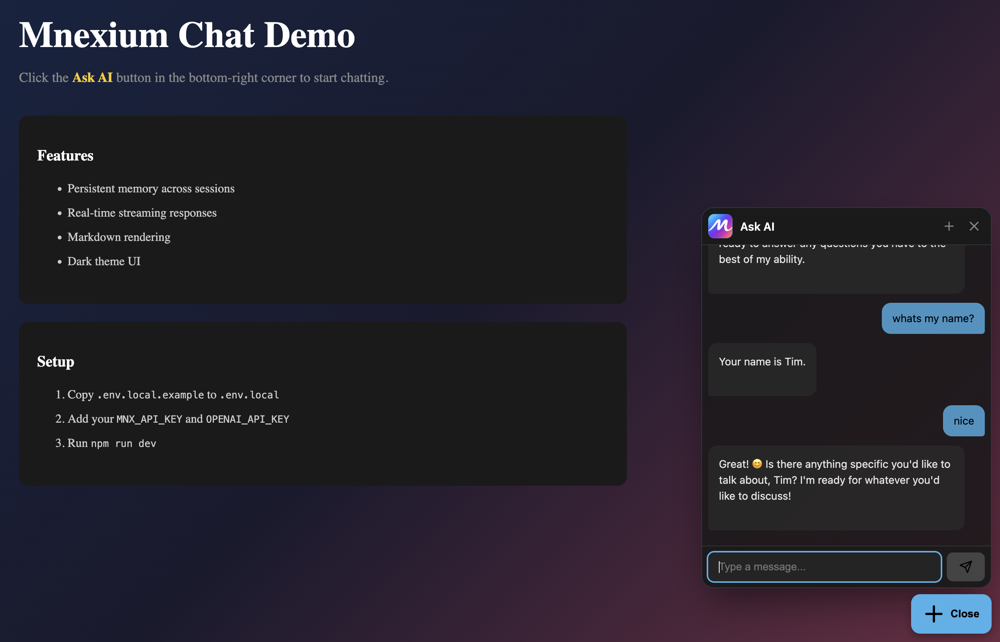

# @mnexium/chat-react

A drop-in React chat widget that gives any web app a full AI chat experience backed by [Mnexium](https://mnexium.com).



## Features

- **Floating Widget** - Modern glassmorphism design with smooth animations
- **Persistent Memory** - Conversations and user context persist across sessions
- **Streaming Responses** - Real-time streaming with typing effect
- **Multi-Provider Support** - Works with OpenAI, Anthropic Claude, and Google Gemini
- **Markdown Rendering** - Rich formatting for assistant messages
- **Zero Client-Side Keys** - All API keys stay on your server
- **Theming** - Light and dark themes with customizable primary color
- **Eager Initialization** - Pre-loads on page load for instant chat opening
- **Framework Agnostic** - Works with Next.js, Vite, CRA, and any React app

## Installation

```bash
npm install @mnexium/chat-react
```

## Quick Start

### 1. Add the Chat Widget

```tsx
import { MnexiumChat } from '@mnexium/chat-react';

export default function Layout({ children }) {
  return (
    <>
      {children}
      <MnexiumChat endpoint="/api/mnx" />
    </>
  );
}
```

This adds a floating "Ask AI" button to the bottom-right of your page. Click it to open the chat.

### 2. Set Up Server Routes (Recommended Pattern)

Create a shared configuration file to avoid repeating options across routes:

**`app/api/mnx/_mnx.ts`**

```ts
import { createHandlers } from '@mnexium/chat-react/server';

export const mnx = createHandlers({
  model: process.env.MODEL ?? 'gpt-4o-mini',
  cookiePrefix: 'mnx',
  mnxOptions: {
    history: true,
    learn: true,
    recall: true,
    profile: true,
    summarize: 'balanced',
  },
});
```

Then create simple route files:

**`app/api/mnx/bootstrap/route.ts`**

```ts
import { mnx } from '../_mnx';
export const GET = mnx.bootstrap;
```

**`app/api/mnx/chat/route.ts`**

```ts
import { mnx } from '../_mnx';
export const POST = mnx.chat;
```

**`app/api/mnx/new-chat/route.ts`** (optional)

```ts
import { mnx } from '../_mnx';
export const POST = mnx.newChat;
```

**`app/api/mnx/history/route.ts`** (optional)

```ts
import { mnx } from '../_mnx';
export const GET = mnx.history;
```

**`app/api/mnx/conversations/[chatId]/route.ts`** (optional)

```ts
import { mnx } from '../../_mnx';

export async function GET(
  req: Request,
  { params }: { params: { chatId: string } }
) {
  return mnx.conversation(req, params.chatId);
}
```

### 3. Configure Environment Variables

```bash
# .env.local
MNX_API_KEY=mnx_live_...

# Include one or all of the following provider keys:
OPENAI_API_KEY=sk-...
ANTHROPIC_API_KEY=sk-ant-...
GOOGLE_API_KEY=...

# Optionally set the model (defaults to gpt-4o-mini)
# MODEL=gpt-4o-mini
# MODEL=claude-3-haiku-20240307
# MODEL=gemini-2.0-flash-lite
```

## Component Props

| Prop | Type | Default | Description |
|------|------|---------|-------------|
| `endpoint` | `string` | `'/api/mnx'` | Base URL for API routes |
| `title` | `string` | `'Ask AI'` | Chat window header title |
| `buttonLabel` | `string` | `'Ask AI'` | Floating button label |
| `placeholder` | `string` | `'Type a message...'` | Input placeholder |
| `position` | `'bottom-right' \| 'bottom-left'` | `'bottom-right'` | Widget position |
| `primaryColor` | `string` | `'#facc15'` | Accent color (use 6-char hex, e.g. `#45b1eb`) |
| `textColor` | `string` | `'#000'` | Text color for button and user messages |
| `theme` | `'light' \| 'dark'` | `'dark'` | Color theme |
| `defaultOpen` | `boolean` | `false` | Start with chat open |
| `eagerInit` | `boolean` | `true` | Initialize on page load (no "Initializing..." delay) |
| `logo` | `string` | - | URL to custom logo image |
| `welcomeIcon` | `string` | `'👋'` | Emoji shown in empty chat |
| `welcomeMessage` | `string` | `'How can I help you today?'` | Welcome message |
| `history` | `boolean` | `false` | Load previous conversation on open |

## Server Handler Options

### `createHandlers(config)` (Recommended)

Creates all handlers with shared configuration:

```ts
const mnx = createHandlers({
  model: 'gpt-4o-mini',
  cookiePrefix: 'mnx',
  mnxOptions: { ... },
});

// Returns: { bootstrap, chat, newChat, history, conversation }
```

| Option | Type | Default | Description |
|--------|------|---------|-------------|
| `model` | `string` | `'gpt-4o-mini'` | LLM model to use |
| `cookiePrefix` | `string` | `'mnx'` | Prefix for session cookies |
| `mnxOptions.history` | `boolean` | `true` | Enable conversation history |
| `mnxOptions.learn` | `boolean \| 'force'` | `true` | Extract and store memories |
| `mnxOptions.recall` | `boolean` | `true` | Inject relevant memories |
| `mnxOptions.profile` | `boolean` | `true` | Include user profile |
| `mnxOptions.summarize` | `'light' \| 'balanced' \| 'aggressive' \| false` | `'balanced'` | Summarization mode |
| `mnxOptions.system_prompt_id` | `string` | - | Use a saved Mnexium system prompt by ID |

### Individual Handlers

You can also import handlers individually:

```ts
import { bootstrapHandler, chatHandler, newChatHandler, historyHandler, conversationHandler } from '@mnexium/chat-react/server';
```

## Supported Models

**OpenAI:** `gpt-4o`, `gpt-4o-mini`, `gpt-4-turbo`, `gpt-4`, `gpt-3.5-turbo`, `o1`, `o1-mini`

**Anthropic:** `claude-3-opus`, `claude-3-sonnet`, `claude-3-haiku`, `claude-3-5-sonnet`, `claude-sonnet-4`

**Google Gemini:** `gemini-2.0-flash-lite`, `gemini-2.5-flash`, `gemini-1.5-pro`, `gemini-1.5-flash`

## How It Works

1. **On mount**, the client calls `GET /api/mnx/bootstrap`
2. Server generates or retrieves `subject_id` and `chat_id` from cookies
3. If a previous chat exists, it's loaded from Mnexium history
4. **On send**, the client `POST`s to `/api/mnx/chat`
5. Server forwards to Mnexium with memory/history flags
6. Response streams back to client in real-time

All API keys remain server-side. The client never sees or constructs Mnexium requests.

## Full Next.js Example

```
app/
├── api/
│   └── mnx/
│       ├── _mnx.ts           # Shared config
│       ├── bootstrap/
│       │   └── route.ts
│       ├── chat/
│       │   └── route.ts
│       ├── new-chat/
│       │   └── route.ts
│       ├── history/
│       │   └── route.ts
│       └── conversations/
│           └── [chatId]/
│               └── route.ts
└── layout.tsx
```

**`app/layout.tsx`**

```tsx
import { MnexiumChat } from '@mnexium/chat-react';

export default function RootLayout({ children }: { children: React.ReactNode }) {
  return (
    <html lang="en">
      <body>
        {children}
        <MnexiumChat 
          endpoint="/api/mnx"
          title="Ask AI"
          buttonLabel="Ask AI"
          position="bottom-right"
          primaryColor="#45b1eb"
          textColor="#fff"
          theme="dark"
          logo="/logo.png"
          welcomeIcon="🤖"
          welcomeMessage="Ask me anything!"
          history={true}
        />
      </body>
    </html>
  );
}
```

The widget appears as a floating button on every page. Click to open the chat with smooth animations.

## License

MIT
